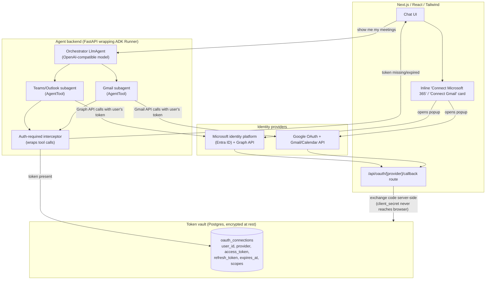
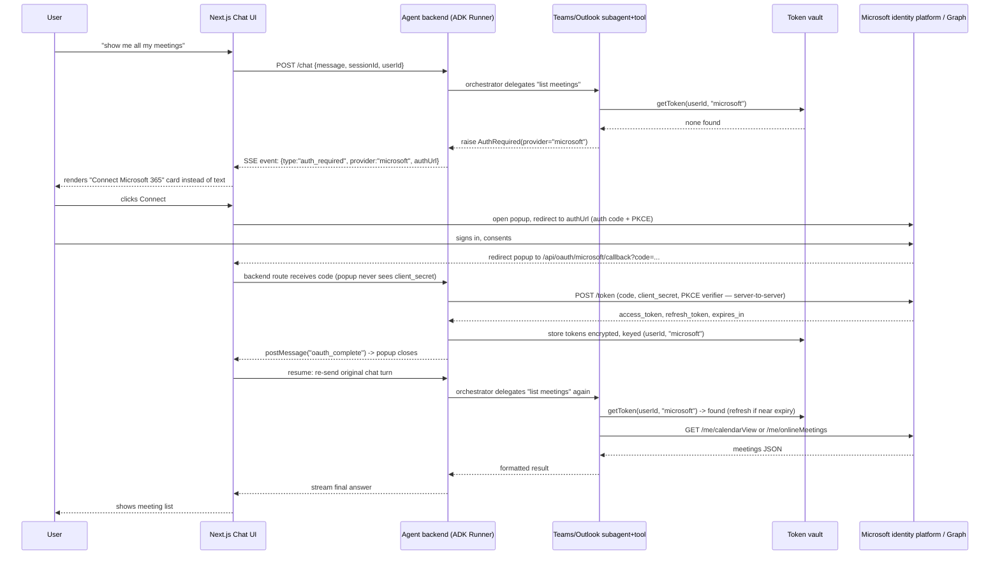

# Multi-connector chat agent with per-user OAuth (Teams/Outlook + Gmail)

Research + architecture + implementation plan. No code has been written for this project yet —
this document is the plan to build from.

## The problem, restated

Chat frontend → orchestrator agent → the agent decides "this needs Microsoft 365" (or Gmail) →
calls a subagent/tool that hits Microsoft Graph (or Gmail API) **as that specific end user**.
Since this is a multi-tenant SaaS (many different users, each with their own Microsoft/Google
account), the agent cannot use one shared service credential — it needs a **per-user, per-provider
OAuth token**, obtained once via a login button and reused (refreshed) on every future request.

The hard part isn't OAuth itself (that's 30-year-old plumbing) — it's that the *token acquisition*
has to happen **inside an agent turn that's already in progress**. The agent starts answering,
discovers it has no valid Microsoft token for this user, and needs to pause, hand control back to
the frontend with "here's a login button," and resume exactly where it left off once the user
finishes the OAuth dance. That pause/resume-with-a-UI-affordance is the actual design problem.

## How Google ADK models this (and where its default flow falls short)

ADK already has a primitive for this. When a tool needs 3-legged OAuth, instead of running the
tool, the framework emits a special function call named `adk_request_credential` (not a real tool
in your toolset — a protocol-level signal) carrying an `AuthConfig` with an `auth_uri`. The client
is expected to:

1. Detect that signal in the streamed run events.
2. Open the `auth_uri` for the user (browser/webview) and let them sign in + consent.
3. Capture the callback URL (`https://.../callback?code=...`).
4. Send that callback URL back to ADK as a `FunctionResponse`, which resumes the paused run.

ADK then does the code→token exchange itself, stashes the token in session state, and
**automatically retries the original tool call** — the tool picks up the token via
`tool_context.get_auth_response()`.

This is exactly the right shape. Two problems make it unsafe to use as-is for a production
multi-tenant app, both documented against `google/adk-python`:

- **[Issue #2128](https://github.com/google/adk-python/issues/2128)** — the `/run_sse` event
  stream serializes the *full* OAuth credential object, including `client_id`/`client_secret`,
  and sends it to the browser client. That's a client secret leaking to every logged-in user.
- **[Issue #1944](https://github.com/google/adk-python/issues/1944)** — when multiple tool calls
  in the same turn need the same OAuth token, the second call re-triggers the code→token exchange
  with an already-consumed authorization code, producing an `invalid_grant` loop.

**Recommendation: use ADK's pause/resume *shape*, but don't let ADK do the second leg of OAuth.**
Terminate the code exchange yourself in a backend route you control, store the resulting tokens in
your own vault, and make your tool wrapper fetch from that vault directly rather than from ADK's
session-state auth response. You keep the "agent pauses, frontend shows a button, agent resumes"
UX without the client-secret leak or the double-exchange bug. This also decouples you from Google's
auth machinery for the *non*-Google providers (Microsoft Graph doesn't have first-class ADK
support anyway — you'd be hand-rolling the `AuthConfig` for it either way).

## Architecture



## Sequence: "show me all my meetings", first time (no Microsoft connection yet)



Second and later requests skip straight from "delegates → getToken → found" to the Graph call —
no button, no interruption. That's the whole point of the vault.

## Token vault: build it yourself, or buy one?

You have two providers today (Microsoft 365, Gmail). That's small enough to hand-roll. Worth
knowing the alternatives exist before you commit, though — this is a fairly saturated space in
2026:

| Option | What it is | Take |
|---|---|---|
| **Self-built** (Postgres table + MSAL/`google-auth-library`) | You own the schema, the refresh logic, the encryption | Right choice at 2 providers. Full control, no vendor risk, you already need a Postgres for the app anyway. |
| **Nango** | Open-source (Elastic License 2.0) credential layer, self-hostable/BYOC, 900+ APIs | Worth adopting later if you add many more providers (Slack, Notion, Salesforce...) — avoids re-deriving refresh-token edge cases per provider. Self-hostable so no closed-runtime risk. |
| **Composio** | Managed, 500+ connectors, closed-source token vault | Fastest breadth, but per-linked-account pricing gets expensive at scale, and it had a **credential-exposure security incident in May 2026** that forced customers to rotate keys and re-auth users. Would not put this in front of a production multi-tenant vault today. |
| **Arcade.dev** | MCP-native runtime, per-action delegated auth, closed execution engine | Best fit if you specifically want fine-grained "can this agent action touch this resource" gating; overkill for "read my calendar." |

Recommendation: **self-built vault now**, revisit Nango if/when the connector list grows past
~4-5 providers.

### Minimal schema

```
users               (id, external_auth_id, email, ...)   -- your app's own login (e.g. NextAuth/Clerk)
oauth_connections   (id, user_id FK, provider enum('microsoft','google'),
                      access_token_encrypted, refresh_token_encrypted,
                      expires_at, scopes text[], tenant_id nullable,
                      created_at, updated_at)
```

Encrypt `*_token_encrypted` with AES-256-GCM using a key from a secrets manager (not in env vars
committed anywhere) — envelope encryption if you want key rotation without re-encrypting every row.

## Provider specifics

**Microsoft (Teams/Outlook, via Microsoft Graph)**
- Register an app in Entra ID as **multi-tenant** (`common` authority) so any org's users can
  consent without you registering per-customer.
- Use **Authorization Code + PKCE** (mandatory for public clients, best practice for all in 2026).
  Use MSAL (`msal-node`) rather than hand-rolled HTTP — it handles cache + silent refresh.
- Request `offline_access` explicitly to get a refresh token (access tokens are ~60-90 min,
  refresh tokens up to ~90 days sliding).
- Scopes for "show my meetings": `Calendars.Read` (and/or `OnlineMeetings.Read` for Teams-specific
  meeting metadata). Graph endpoint: `GET /me/calendarView?startDateTime=...&endDateTime=...`.
- **Client secret exchange happens server-side only** — never in a route the browser popup can
  read from.

**Google (Gmail/Calendar)**
- Standard Google OAuth consent screen. Use `access_type=offline&prompt=consent` on the *first*
  authorization to guarantee you actually get a refresh token (Google only issues it once per
  consent unless you force re-consent).
- Scopes: `gmail.readonly`, `calendar.readonly` (start read-only; only widen if you add
  send/create-event features).
- Use `google-auth-library` for token refresh, same as MSAL on the Microsoft side.

## Frontend: the "interrupt returns a login button" mechanic

1. Your SSE/streaming protocol needs a typed event, not just token deltas:
   `{type: "token", text}` | `{type: "auth_required", provider, authUrl}` | `{type: "done"}`.
2. Chat UI's stream handler renders a `<ConnectCard provider="microsoft" />` component instead of
   plain text when it sees `auth_required`.
3. Clicking it opens `authUrl` in a **popup window**, not a full-page redirect — this preserves
   the chat state/session that's still open in the main tab.
4. Your `/api/oauth/microsoft/callback` route (runs in the popup) does the server-side code
   exchange, writes to the vault, then responds with a tiny HTML page that does
   `window.opener.postMessage({type:"oauth_complete", provider:"microsoft"}, origin)` and
   `window.close()`.
5. Main tab's `message` listener catches `oauth_complete` and **resubmits the original user
   turn** to the backend — the tool call now finds a token in the vault and just works. (No need
   to resume ADK's own paused run — you short-circuited ADK's OAuth continuation entirely per the
   recommendation above, so "resume" here just means "ask the same question again.")

## Orchestrator → subagent delegation in ADK

Root agent has `sub_agents=[teams_agent, gmail_agent]` (or wraps them as `AgentTool`s so it
delegates via normal function-calling). Each subagent owns its own tools:

- `teams_agent` → tools: `list_meetings(user_id)`, `get_meeting_details(meeting_id)` — internally
  call your vault for the token, then call Graph.
- `gmail_agent` → tools: `search_emails(user_id, query)`, `list_unread(user_id)`.

The LLM routes "show me my meetings" to `teams_agent` purely from tool/subagent descriptions —
no special-casing needed in your prompt beyond good tool docstrings.

## Implementation plan (phased)

1. **Foundations** — Next.js (App Router) + Tailwind scaffold; FastAPI service wrapping an ADK
   `Runner`; Postgres; decide your *app's own* user auth (NextAuth/Clerk) — separate from the
   provider OAuth connections above.
2. **Bare chat loop** — Chat UI ↔ FastAPI ↔ OpenAI-compatible model, SSE streaming, no tools yet.
3. **Orchestrator + one mock subagent** — validate delegation and the typed SSE event protocol
   (`token`/`auth_required`/`done`) end-to-end with a fake tool that always returns
   `auth_required` on first call, `data` on second — proves the resume UX before touching real
   OAuth.
4. **Microsoft connector, for real** — Entra ID app registration, MSAL-node code+PKCE flow
   terminated in your own callback route, vault table + encryption, Graph client wrapper,
   `list_meetings` tool.
5. **Google connector** — mirror phase 4 with `google-auth-library` and Gmail/Calendar scopes.
6. **Frontend polish** — `ConnectCard` component, popup+`postMessage` handshake, resend-on-complete
   logic, a "Connected accounts" settings page (view/revoke connections).
7. **Hardening** — proactive token refresh (cron or on-demand before expiry), revoke/disconnect
   flow that also calls the provider's token-revocation endpoint, audit log of which tool touched
   which user's data when, redirect-URI allowlist, rate limiting on the OAuth callback routes.
8. **Revisit vault choice** — if you add a 4th/5th connector, re-evaluate self-built vs. Nango
   (self-hosted) rather than hand-rolling another provider's refresh-token edge cases.

## Sources

- [ADK Authentication docs](https://google.github.io/adk-docs/tools-custom/authentication/)
- [ADK Tool Authentication — DeepWiki](https://deepwiki.com/google/adk-docs/4.8-tool-authentication)
- [ADK issue #1944 — invalid_grant loop on repeated OAuth tool calls](https://github.com/google/adk-python/issues/1944)
- [ADK issue #2128 — client_secret exposed to untrusted clients](https://github.com/google/adk-python/issues/2128)
- [Microsoft Graph — get access on behalf of a user](https://learn.microsoft.com/en-us/graph/auth-v2-user)
- [Microsoft identity platform scopes/permissions](https://learn.microsoft.com/en-us/entra/identity-platform/scopes-oidc)
- [Nango — best token vaults for AI agents in 2026](https://nango.dev/blog/best-token-vaults-and-credential-management-tools-for-ai-agents/)
- [Arcade.dev — best AI agent authentication platforms 2026](https://www.arcade.dev/blog/best-ai-agent-authentication-platforms/)
